# AgentAid Disaster Response Flow

## System Architecture Overview

This document outlines the complete flow of the AgentAid disaster response system, showing how the HTML interface interacts with Python services and AI agents.

## Flow Diagram

```mermaid
graph TB
    %% User Interface Layer
    UI[🌐 Disaster Response HTML<br/>localhost:3000/disaster-response.html]

    %% Claude Service Layer
    CS[🤖 Claude Service<br/>Node.js + Express<br/>Port 3000]

    %% Python Agent Layer
    CA[🎯 Coordination Agent<br/>Python uAgent<br/>Port 8002]
    NA[📋 Need Agent<br/>Python uAgent<br/>Port 8000]
    SA1[📦 Supply Agent 1<br/>Python uAgent<br/>Port 8001]
    SA2[📦 Supply Agent 2<br/>Python uAgent<br/>Port 8003]

    %% Database Layer
    DB[(🗄️ SQLite Database<br/>agent_aid.db)]
    CDB[(🧠 ChromaDB<br/>Vector Database)]

    %% External Services
    GEO[🌍 Geocoding Service<br/>OpenStreetMap API]
    TELE[📊 Telemetry Service<br/>Port 8088]

    %% Flow Connections
    UI -->|POST /api/extract| CS
    CS -->|Claude AI Processing| CS
    CS -->|Store Request| CDB
    CS -->|Geocode Address| GEO
    CS -->|GET /api/uagent/pending-requests| CA

    CA -->|QuoteRequest| NA
    CA -->|QuoteRequest| SA1
    CA -->|QuoteRequest| SA2

    NA -->|QuoteResponse| CA
    SA1 -->|QuoteResponse| CA
    SA2 -->|QuoteResponse| CA

    CA -->|AllocationNotice| SA1
    CA -->|AllocationNotice| SA2

    SA1 -->|Inventory Check| DB
    SA2 -->|Inventory Check| DB

    CA -->|Status Updates| TELE
    NA -->|Status Updates| TELE
    SA1 -->|Status Updates| TELE
    SA2 -->|Status Updates| TELE
```



## Detailed Request Flow

### 1. User Submits Disaster Request

**HTML Form → Claude Service**

```javascript
// disaster-response.html (Lines 487-555)
async function submitDisasterRequest() {
    const formData = {
        items: document.getElementById('items').value,
        quantity: document.getElementById('quantity').value,
        location: document.getElementById('location').value,
        contact: document.getElementById('contact').value,
        victimCount: document.getElementById('victimCount').value,
        priority: selectedPriority
    };

    const response = await fetch('/api/extract', {
        method: 'POST',
        headers: { 'Content-Type': 'application/json' },
        body: JSON.stringify({
            input: createNaturalLanguageInput(formData),
            source: 'disaster_response_ui'
        })
    });
}
```

### 2. Claude Service Processing

**Claude AI Extraction → Follow-up System → Geocoding**

```javascript
// server.js (Lines 121-280)
app.post('/api/extract', async (req, res) => {
    // 1. Extract structured data using Claude AI
    const structuredData = await extractDisasterData(input);

    // 2. Check if follow-up is needed
    const followupCheck = await generateFollowupQuestions(structuredData, input);

    if (followupCheck && followupCheck.needs_followup) {
        // Store incomplete data in session
        storeSession(followupCheck.session_id, {
            original_data: structuredData,
            original_input: input,
            source: source
        });

        return res.json({
            success: true,
            needs_followup: true,
            session_id: followupCheck.session_id,
            completeness_score: followupCheck.completeness_score,
            followup_message: followupCheck.followup_message
        });
    }

    // 3. Store complete request
    await storeRequest(structuredData);
    requests.push(structuredData);

    // 4. Format for uAgent coordination
    const agentPayload = formatForUAgent(structuredData);

    return res.json({
        success: true,
        data: structuredData,
        agent_payload: agentPayload,
        needs_followup: false
    });
});
```

### 3. Coordination Agent Processing

**Claude Service → Coordination Agent → Need/Supply Agents**

```python
# coordination_agent.py (Lines 90-116)
async def monitor_claude_service(ctx: Context):
    """Poll Claude service for new disaster requests"""
    while True:
        try:
            async with httpx.AsyncClient(timeout=10) as client:
                # Get pending requests from Claude service
                response = await client.get(f"{CLAUDE_SERVICE_URL}/api/uagent/pending-requests")

                if response.status_code == 200:
                    data = response.json()
                    if data.get("success") and data.get("requests"):
                        for req_data in data["requests"]:
                            await process_new_request(ctx, req_data)
```

**Request Assignment to Agents**

```python
# coordination_agent.py (Lines 196-257)
async def assign_request_to_agents(ctx: Context, disaster_req: DisasterRequest):
    """Assign disaster request to appropriate need and supply agents"""

    # Find available agents
    need_agents = [agent for agent in agent_registry.values()
                   if agent.agent_type == "need" and agent.status == "active"]
    supply_agents = [agent for agent in agent_registry.values()
                     if agent.agent_type == "supply" and agent.status == "active"]

    # Create quote request
    quote_req = QuoteRequest(
        need_id=disaster_req.request_id,
        location=geo,
        items=items,
        priority=disaster_req.priority,
        max_eta_hours=24.0
    )

    # Send to all agents
    for need_agent in need_agents:
        await ctx.send(need_agent.address, quote_req)

    for supply_agent in supply_agents:
        await ctx.send(supply_agent.address, quote_req)
```

### 4. Need Agent Processing

**Coordination Agent → Need Agent → Quote Response**

```python
# need_agent.py (Lines 72-99)
async def send_need(ctx: Context):
    need_id = f"need_{uuid.uuid4().hex[:6]}"

    # Create quote request with items and location
    req = QuoteRequest(
        need_id=need_id,
        location=Geo(lat=lat, lon=lon, label=label),
        items=req_items,
        priority=priority,
        max_eta_hours=max_eta,
    )

    # Broadcast to supply agents
    for addr in SUPPLY_ADDRESSES:
        await ctx.send(addr, req)
```

### 5. Supply Agent Processing

**Need Agent → Supply Agent → Inventory Check → Quote Response**

```python
# supply_agent.py (Lines 78-136)
@agent.on_event("startup")
async def on_start(ctx: Context):
    """Ensure supplier row exists, log current address + inventory"""
    global SUPPLIER_ID, CFG
    SUPPLIER_ID = ensure_supplier(CONN, SUPPLIER_NAME, ...)
    CFG = get_supplier_config(CONN, SUPPLIER_NAME) or {}
    inv = get_inventory(CONN, SUPPLIER_ID)

    ctx.logger.info(f"Inventory: {', '.join([f'{row['name']}:{row['qty']}' for row in inv])}")
```

**Quote Response Generation**

```python
# supply_agent.py (Lines 138-200)
@AidProtocol.on_message(model=QuoteRequest)
async def on_quote_request(ctx: Context, sender: str, req: QuoteRequest):
    """Handle incoming quote requests"""

    # Check inventory availability
    offers = offer_for_request(CONN, SUPPLIER_ID, req.items)

    if not offers:
        ctx.logger.info(f"No inventory for {req.need_id}")
        return

    # Calculate costs and ETA
    total_cost = sum(offer["unit_cost"] * offer["qty"] for offer in offers)
    distance_km = haversine_km(_cfg_geo(), req.location)
    eta_hours = CFG["base_lead_h"] + (distance_km / 50.0)  # 50 km/h average

    # Send quote response
    resp = QuoteResponse(
        need_id=req.need_id,
        supplier_id=SUPPLIER_NAME,
        items=offers,
        total_cost=total_cost,
        eta_hours=eta_hours,
        coverage_ratio=sum(offer["qty"] / req.items[i].qty for i, offer in enumerate(offers)) / len(offers)
    )

    await ctx.send(sender, resp)
```

### 6. Response Collection and Allocation

**Coordination Agent → Best Quote Selection → Allocation Notice**

```python
# coordination_agent.py (Lines 281-320)
@AidProtocol.on_message(model=QuoteResponse)
async def on_quote_response(ctx: Context, sender: str, resp: QuoteResponse):
    """Handle quote responses from agents"""
    ctx.logger.info(f"Quote response from {sender}: {resp.supplier_id}")
    ctx.logger.info(f"  Cost: ${resp.total_cost}, ETA: {resp.eta_hours}h")
    ctx.logger.info(f"  Coverage: {resp.coverage_ratio}")

    # Emit telemetry
    await emit({
        "ts": time.time(),
        "agent_type": "coordinator",
        "event_type": "quote_received",
        "request_id": resp.need_id,
        "supplier_id": resp.supplier_id,
        "cost": resp.total_cost,
        "eta_hours": resp.eta_hours,
        "coverage": resp.coverage_ratio
    })
```

## Key Components

### 1. HTML Interface (`disaster-response.html`)
- **Purpose**: User-friendly disaster request submission
- **Features**:
  - Form validation and priority selection
  - Real-time status updates
  - Follow-up question handling
  - Request history display

### 2. Claude Service (`server.js`)
- **Purpose**: AI-powered request processing and coordination
- **Features**:
  - Natural language extraction using Claude AI
  - Intelligent follow-up system
  - Geocoding integration
  - ChromaDB vector search
  - Session management

### 3. Coordination Agent (`coordination_agent.py`)
- **Purpose**: Central coordinator for all agent communication
- **Features**:
  - Polls Claude service for new requests
  - Assigns requests to appropriate agents
  - Collects and evaluates quotes
  - Manages agent registry

### 4. Need Agent (`need_agent.py`)
- **Purpose**: Represents disaster victims and their needs
- **Features**:
  - Broadcasts quote requests to supply agents
  - Evaluates quotes using intelligence data
  - Manages need prioritization

### 5. Supply Agent (`supply_agent.py`)
- **Purpose**: Represents suppliers and their inventory
- **Features**:
  - Inventory management via SQLite database
  - Quote generation based on availability
  - Cost calculation and ETA estimation
  - Geographic distance calculations

## Data Flow Summary

1. **User Input** → HTML form submission
2. **AI Processing** → Claude extracts structured data
3. **Follow-up Check** → System determines if more info needed
4. **Geocoding** → Address converted to coordinates
5. **Agent Coordination** → Request distributed to agents
6. **Quote Collection** → Supply agents respond with quotes
7. **Allocation** → Best quote selected and confirmed
8. **Status Updates** → All parties notified of progress

## API Endpoints

### Claude Service (Port 3000)
- `POST /api/extract` - Main request processing
- `GET /api/uagent/pending-requests` - Get pending requests
- `POST /api/uagent/claim-request` - Claim request
- `POST /api/uagent/update` - Status updates
- `GET /health` - Service health check

### Python Agents
- **Coordination Agent**: Port 8002
- **Need Agent**: Port 8000
- **Supply Agent 1**: Port 8001
- **Supply Agent 2**: Port 8003

## Technologies Used

- **Frontend**: HTML5, CSS3, JavaScript (ES6+)
- **Backend**: Node.js, Express.js
- **AI**: Claude Sonnet 4.5 (Anthropic)
- **Agents**: Python uAgents (Fetch.ai)
- **Database**: SQLite, ChromaDB
- **Geocoding**: OpenStreetMap API
- **Telemetry**: FastAPI service

This system provides a complete end-to-end disaster response coordination platform that combines AI-powered request processing with intelligent agent-based resource allocation.
